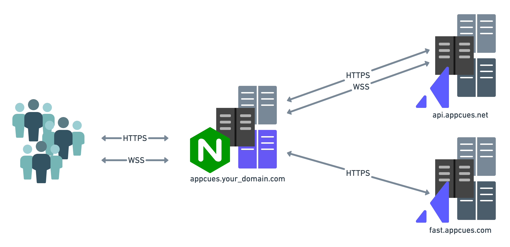

# How To: Self-host the Appcues SDK Bootstrap Script

# Overview

This document covers self-hosting the Appcues SDK's Bootstrap script and configuring it to proxy Appcues endpoints. Self-hosting may be required by some organization's security policies.    

Once self-hosted:

- Your end-users will load this script from a host that you configure instead of from Appcues `fast.appcues.com`
- You can create a [sub-resource integrity hash](https://developer.mozilla.org/en-US/docs/Web/Security/Subresource_Integrity) for the script.  This security feature enables browsers to verify the script they are fetching is delivered without unexpected manipulation. It works by allowing you to provide a cryptographic hash that a fetched resource must match.
- You will need to manually update to new versions of the script whenever changes to the script occur.

**WARNING:** Unless your security needs specifically require it, self-hosting and proxying is not recommended.  Self-hosting the SDK bootstrap script means you will not automatically receive new versions of the bootstrap script and will need to update your copy of this script if changes to it are made. If you do not update, it may make you unable to receive new Appcues features and functionality. To be alerted of changes, we recommend following this Github repo.

# Self-Hosting the SDK Bootstrap Script

## Requirements

- Ability to host the [bootstrap javascript file](bootstrap.js) and serve it to your end-users. Depending on your end-user volume you may wish to host the script on a CDN

## How-To

Self-hosting the SDK Bootstrap Script is as easy as swapping out `<your appcues account id>` for your account id (located on the `Settings` page in Studio).

Host the script so that your front end can access it and load the script as you like. 

## Testing

Testing can be done by loading the script on your site and seeing it function.

The easiest test is to open the browser's Javascript console and run the command `Appcues.debug()` . More information on the `debug` command can be found on [our docs site](https://docs.appcues.com/article/34-debugging-your-appcues-installation).

# Proxying Appcues

It is possible to proxy Appcues' endpoints  if your security posture requires it. This will lead to your end-users interacting with your proxy instead of directly with Appcues' owned `fast.appcues.com` and `api.appcues.net`

**WARNING:** Proxying Appcues endpoints requires that you host and configure a proxy that is capable of serving your end-user scale. Appcues does not provide a ready-made proxy implementation so you must provide your own.

## Requirements

- If proxying `fast.appcues.com`, your proxy must support `GET` requests for any path of that domain.
- If proxying `api.appcues.net`, your proxy must support `GET` and `POST` requests for any path of that domain in addition to support for proxying WebSocket connections.
    - When proxying `api.appcues.net` your proxy must be able to support your end-user workload. Appcues is unable to provide estimates for your specific workload because it is a function of your active users, the number of calls your app makes to Appcues, the size of your content, and the amount of content being shown.

## How-To

First, you must create a proxy system that meets the requirements outlined above. This can be accomplished with the proxy technology of your choice. One example of a technology is [NGINX](https://docs.nginx.com/nginx/admin-guide/web-server/reverse-proxy/).

An example architecture for an NGINX proxy to Appcues' endpoints might look like this:

Once you have a proxy, you will need to update your self-hosted SDK bootstrap script to reference your proxy.

- If proxying `fast.appcues.com` update the hostname in the value of `APPCUES_BUNDLE_DOMAIN` to reflect your proxy domain hostname.
- If proxying `api.appcues.net` update the value of `APPCUES_API_HOSTNAME` to reflect your proxy domain.

## Testing

Testing is as simple as loading the script on your site and seeing it function.

The easiest test is to open the browser's Javascript console and run the command `Appcues.debug()` . More information on the `debug` command can be found on [our docs site](https://docs.appcues.com/article/34-debugging-your-appcues-installation).

# Questions?

Appcues support can answer any questions you have about the content of this document however Appcues can not consult on your proxy implementation.
